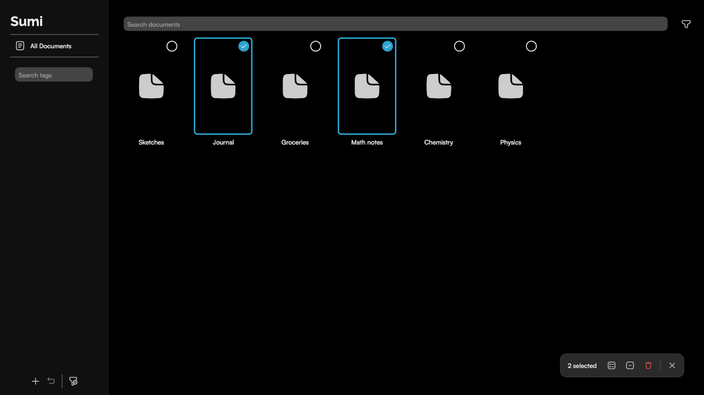

# Floating action bar: the reference component

The document browser's select-mode bar (`TagDocList::createUI()`, `createSelectBarButton()`) was
approved as the model for UI to come: a group of FAB-sized buttons inside one rounded container,
floating over the content and taking the place of the FABs while a mode is active. Build new
floating toolbars, mode bars and action groups the same way, with the same numbers.



All values are ugui units. `setMargins()` takes **top, right, bottom, left** (CSS order), and a
two-argument call is (vertical, horizontal).

## Anatomy

```
 selectBar  (box layout, box-anchor "bottom right", margins 0 48 43 0)
 ├─ background rect   box-anchor fill, radius 14, fill #2A2A2A, stroke #444444 1
 └─ row               flex row, align-items center, margins 6 on all sides
    ├─ label          "2 selected", font-size 15, fill var(--text), margins 0 14 0 12
    ├─ button  44x44  Select All
    ├─ button  44x44  Select None
    ├─ button  44x44  Delete (destructive)
    ├─ separator      1x28 rect, fill #555555, margins 0 6
    └─ button  44x44  Done (X) - always last, where the primary FAB sits
```

## Exact values

| Element | Value |
|---|---|
| Bar position | anchored bottom right, **48** from the right, **43** from the bottom (same as the FAB row, so the bar replaces it in place) |
| Container | corner radius **14**, fill **#2A2A2A**, 1-unit stroke **#444444** |
| Container padding | **6** on every side, between the container edge and its contents |
| Buttons | **44 x 44** slot, corner radius **10**, no gap between neighbouring buttons |
| Button background | none at rest, **#444444** hovered, **#555555** pressed |
| Button icon | **20 x 20**, theme `--icon` color; disabled: `var(--icon-disabled)` |
| Destructive icon | **#E5534B** (red), `--icon-disabled` when disabled |
| Label | font-size **15**, `var(--text)`, Satoshi (inherited from `.tagdoclist`); **12** left, **14** right |
| Separator | **1 x 28**, fill **#555555**, **6** on either side |

The inner radius works out: a 10-radius button 6 units inside a 14-radius container keeps the
corners concentric (14 - 6 = 8, close enough to 10 that it reads as parallel at this size).

## The FABs it sits beside (`createFab()`)

| | Size | Radius | Fill | Icon | Spacing |
|---|---|---|---|---|---|
| Secondary FAB | 44 x 44 | 10 | #444444 | 18 x 18 | 17 to the right |
| Primary FAB | 56 x 56 | 10 | #2EA3CF (accent) | 27 x 27 | - |

The bar's buttons are the secondary FAB's size and radius minus the fill: the container is their
shared background.

## Selection marks on cards

| Element | Value |
|---|---|
| Ring | the preview slot's size, radius **6**, stroke **#2EA3CF** width **3**, no fill; shown when checked |
| Badge | **24 x 24**, radius **12** (a circle), **8** from the slot's top and right edges |
| Badge, unselected | fill #000000 at opacity **0.45**, stroke **#FFFFFF** width **1.5** - shows the cell can be picked |
| Badge, selected | fill and stroke **#2EA3CF** |
| Check | `ic_menu_accept`, **16 x 16**, white, shown only when checked |
| Not selectable | the whole cell at opacity **0.35** and inert |

## Behaviour rules

- **A mode swaps the controls, it does not add to them.** Entering select mode hides the FAB row and
  shows the bar in the same corner; leaving restores the FABs. Escape leaves too.
- **The label carries the state** ("Select documents" / "2 selected"), and buttons that would do
  nothing are disabled rather than hidden, so the bar's layout does not jump.
- **Exit is the last button** and is always enabled.
- Hover/pressed/disabled come from the classes ugui's `Button` sets (`hovered`, `pressed`, `disabled`,
  `checked`); style them in `ugui/theme.cpp` scoped to the window class (`.tagdoclist ...`). Toggle a
  state in place with `Button::setChecked()` + a `.checked` rule rather than rebuilding widgets.
- The background is a `SvgRect` with `box-anchor="fill"` inside a box-layout `<g>`: the box layout
  ignores width/height on a `<g>`, so size comes from the contents plus the row's margins.

## Code skeleton

```cpp
Widget* bar = new Widget(new SvgG());
bar->node->addClass("selectbar");
bar->node->setAttribute("box-anchor", "bottom right");
bar->node->setAttribute("layout", "box");
bar->setMargins(0, 48, 43, 0);
SvgRect* bg = new SvgRect(Rect::wh(20, 20), 14, 14);
bg->addClass("selectbar-bg");
bg->setAttribute("box-anchor", "fill");
bar->containerNode()->addChild(bg);

Widget* row = new Widget(new SvgG());
row->node->setAttribute("layout", "flex");
row->node->setAttribute("flex-direction", "row");
row->node->setAttribute("align-items", "center");
row->setMargins(6);
// label (margins 0 14 0 12), createSelectBarButton(icon, tooltip) x N,
// separator (1x28, margins 0 6), done button last
bar->addWidget(row);
```

```css
.tagdoclist .selectbar-bg { fill: #2A2A2A; stroke: #444444; stroke-width: 1; }
.tagdoclist .selectbar-count { fill: var(--text); font-size: 15; }
.tagdoclist .selectbar-sep { fill: #555555; }
.tagdoclist .selectbar-btn-bg { fill: none; }
.tagdoclist .selectbar-btn.hovered .selectbar-btn-bg { fill: #444444; }
.tagdoclist .selectbar-btn.pressed .selectbar-btn-bg { fill: #555555; }
.tagdoclist .selectbar-btn.disabled .icon { fill: var(--icon-disabled); color: var(--icon-disabled); }
.tagdoclist .selectbar-delete .icon { fill: #E5534B; color: #E5534B; }
```

The colors are hardcoded dark-theme values, like the rest of the browser's styles. A light theme
would need them as theme variables.

## Top padding (status bar)

Nothing is painted behind the status bar; content steps down instead (`ScribbleApp::topInset`, see
[document-library.md](document-library.md#top-inset-ios-status-bar)):

| Element | Top | Right | Bottom | Left |
|---|---|---|---|---|
| Browser search row | **8 + topInset** | 24 | 0 | 24 |
| Editor `#main-toolbar-container` | **topInset** | 0 | 0 | 0 |
| Sidebar panel | sbTopInset **+ topInset** | unchanged | unchanged | unchanged |

`topInset` is the top safe area: the status bar's height (about 24 on iPad), the notch on a portrait
iPhone, 0 in fullscreen and on desktop. Anything new pinned to the top edge should add it the same way.
