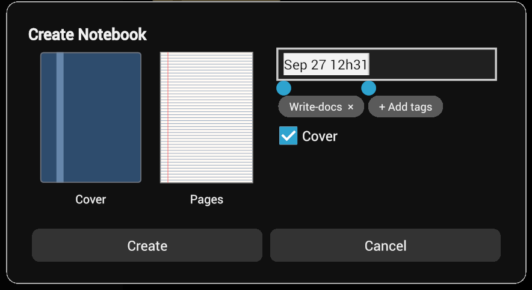
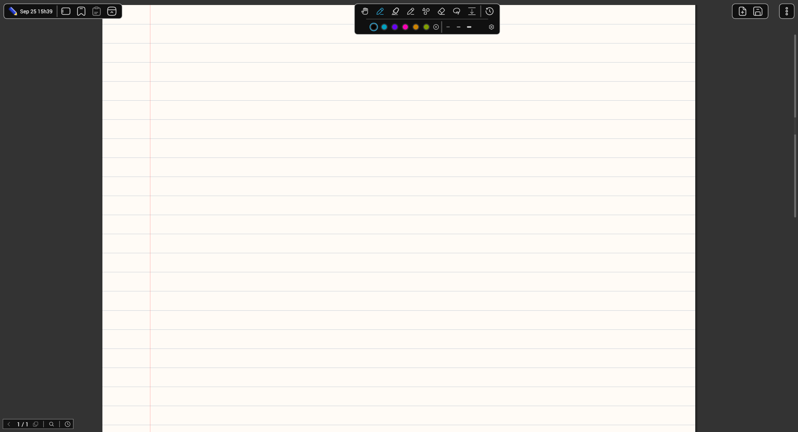
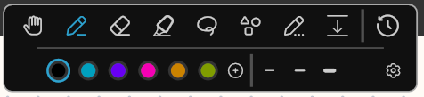
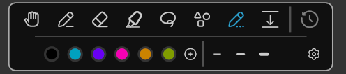
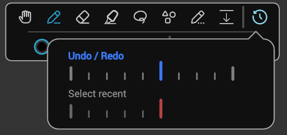
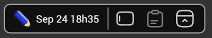
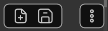

## Create a notebook

Press the large blue button in the bottom right of the screen. You now have

Click on the cover and the page to change the layout. Then modify the name. You don't have to concern yourself with tags yet, but please do in due time since they are one of Sumi's standout features.

## Inside your notebook

When you have created your first notebook, you are greeted with a screen like this:

If you have a stylus, move around with your fingers, you can pinch and so on. Otherwise, on pc you can use the middle mouse button, scroll or use the move tool.

In the top middle of the screen you can see your:

### Main Handwriting Tools

I will explain the necessary things, but you can find more detailed explanations of the toolbar and its tools by either visiting the [dedicated documentation](./the-tools/index.mdx) or by pressing the `?` button available in some tools.

In the top part of this toolbar, you can select the tool you want, and below are its quick settings. You can toggle them by pressing the active tool again.

#### The Pen

Your main tool will be the **pen**, currently active in the screenshot. It is used to write in different colors and widths.

- To *add* a color to the selection, press the plus button next to the colors.
- To *change* a color or width preset, press it again once it's active.

If you press and hold in one spot after drawing, Sumi will try to recognize your stroke as one of:

- A straight line
- An ellipse/circle
- A rectangle
- A scribble that will erase everything underneath it (a zigzag line, very handy if you don't want to switch to the eraser)

<Callout type="warn" title="I do not recommend adding custom colors.">
  The app generates the colors in the color picker to fit together. If you select a custom color, it will look out of place and won't adapt if you decide to change the theme later.
</Callout>

#### The rest of the tools

Many tools have this toggle:

Which, when turned on, switches back to the previous tool after using the current one.

These tools are from left to right.

- the **eraser**: Not just your run-of-the-mill eraser. It can erase full strokes or parts of them (press the question mark in its quick settings). But it has a trick up its sleeve:
  - Ruled erase. When toggled, the eraser will only erase strokes that belong to this line. Useful when your handwriting from the line above overlaps with your current line.
- the **highlighter**: Use it to highlight text. The optional button with the lines makes it a straight line centered between the lines of your document (I highly recommend it!)
- the **select tool**: With this tool, you can select, modify and move objects. It has multiple modes. Again, press the question mark.
- the **shape tool**: Select from predefined shapes and arrows (use the arrow left and arrow right toggles on lines to add an arrow to the start or end of a line)
- the **ephemeral pen**: Like the pen, but it does not stick around after you stop holding down.
- the **spacer tool**: This tool can move your strokes downward or upward, creating space. You can also move left and right in the ruled mode and Sumi will automatically reflow your writing.
- and last but *certainly* not least:

#### Undo and redo

Undo/redo in Sumi works very differently from what you are probably used to. It is more like a *timeline* than a button.

You use it by pressing and holding it, and moving your mouse downward into the panel. Select whether you want to undo/redo or select items in chronological order by moving your mouse to the top or bottom half of the panel. Then move your mouse horizontally to go back/forward.

> Pretty cool, right?

You can also press without holding to simply undo.

### The rest of the toolbars

I will quickly go over the rest of the toolbars just so you know what they do.

Left to right:

- Go back to the notebook library
- Sidebar toggle
- Paste
- Split screen

- Add a page
- Save
- Menu

<Callout type="success" title="Congrats">
  You are now proficient with Sumi :)
</Callout>

I recommend you also quickly glance at [notebook organization](./notebook-organization.mdx), since that is a big part of the workflow. You can also do that later once you have a few notebooks and want to organize them.
